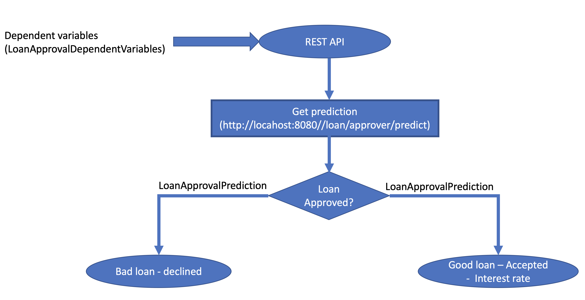
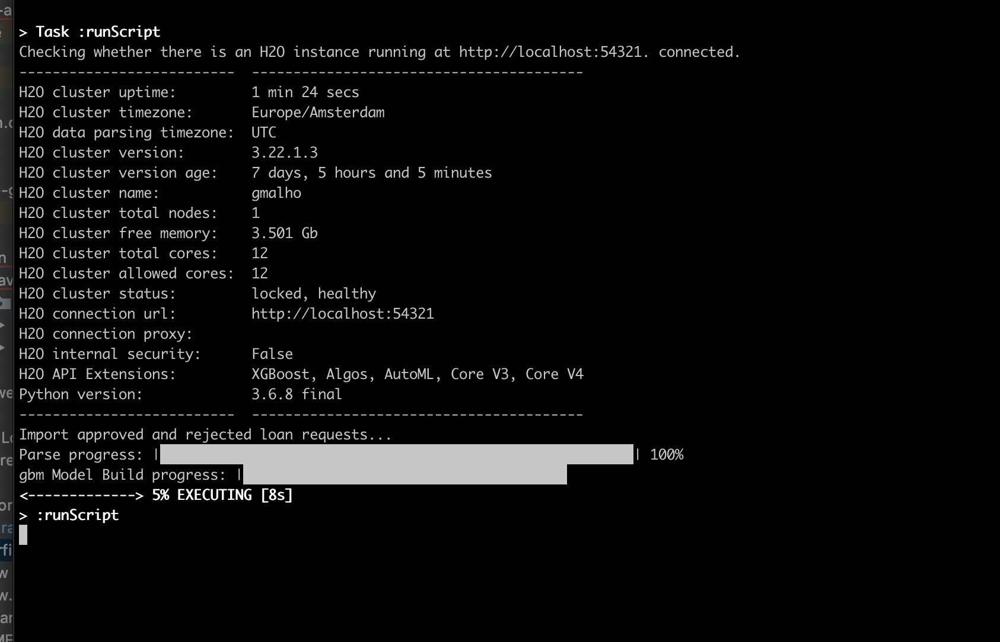
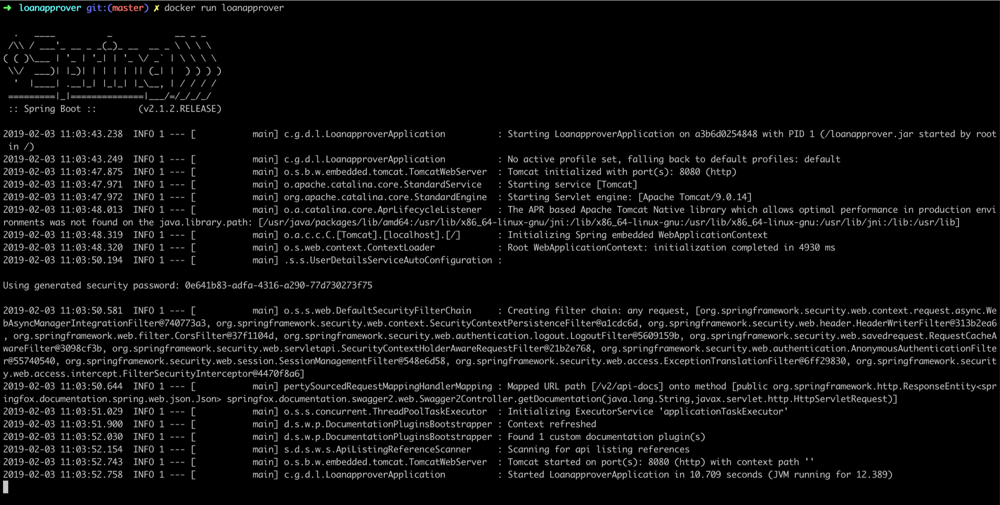
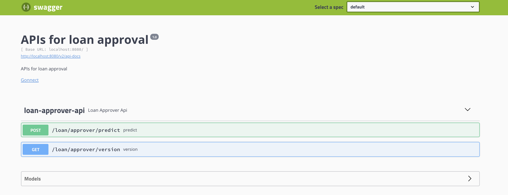
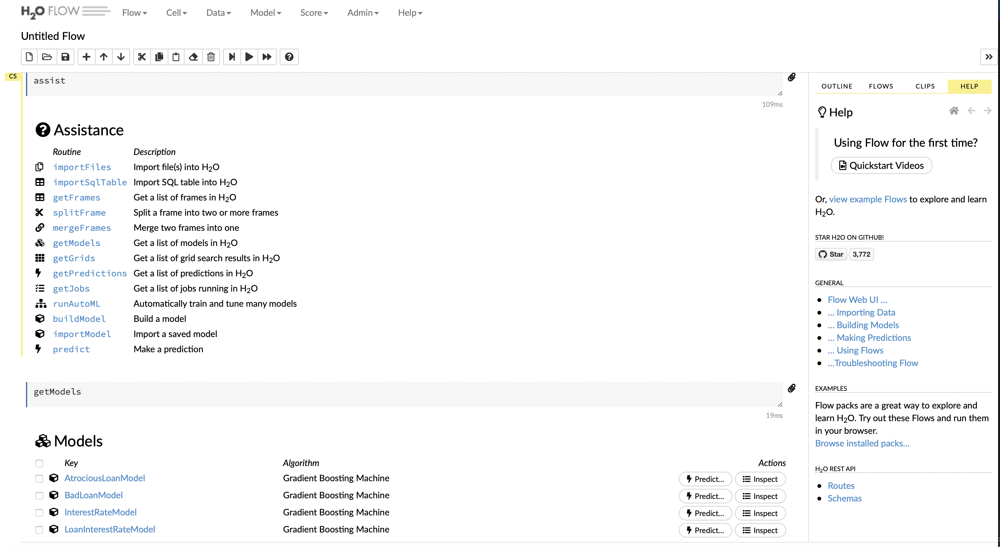

# QuickLoanPrediction - Loan Approver Using Spring BOOT and H2O AutoML [Rule Based To ML Based Loan Prediction]

## Introduction

This project demonstrates a loan approval application built using **Spring Boot** and **H2O’s AutoML**. The goal of the application is to predict whether a loan should be approved and what interest rate should be offered. The system makes use of **Gradient Boosting Models** for binary classification and regression tasks based on the provided dataset. 

Here are the key features of the application:

1. **ML as a service using Spring Boot**
2. **Dockerize ML model + REST API**
3. **Polygot programming model**: Loan Approver model & interest calculation is written in **Python/R**
4. **Model stored as POJO (Plain Old Java Object)**

Note: This project showcases the integration of machine learning with **Spring Boot** as a REST API. It allows rolling out new versions of the model seamlessly and performing A/B testing in real-time production systems.

The architecture of the Loan Approver application allows:
1. **Programmers** to use their preferred programming languages (Python/R) and frameworks.
2. **Ease of production deployment** through Dockerization.
3. **Seamless integration of ML models as REST APIs using Spring Boot** for real-time prediction.

This architecture style is useful for multiple use cases, including:
- Health insurance fraud detection
- ePayment card fraud detection
- Retail (eCommerce) inventory optimization
- And more...

## Loan Approver Application Overview

The **QuickLoanPrediction** system is a smart application that uses machine learning to decide whether a loan should be approved. It consists of two predictive models:

- **Loan Approval Model**: Predicts whether the loan is a bad loan (yes/no)
- **Interest Rate Model**: Predicts the interest rate if the loan is approved.

The model is created following these steps:

- Step 1: Prepare the model to answer the prediction question.
- Step 2: Use relevant data to create the model.
- Step 3: Export the model as a Java POJO.
- Step 4: Compile the Java model using Gradle.
- Step 5: Deploy the model using **Spring Boot** on **Tomcat**.
- Step 6: Expose the model as a REST API along with dependent variables, and provide a Swagger UI for testing.

## Machine Learning Data Model

| **Predictor/Independent Variable** | **Description**                              | Units        |
| ---------------------------------- | --------------------------------------------- | ------------ |
| loan_amnt                          | Requested loan amount                         | US dollars   |
| term                               | Loan term length                              | months       |
| emp_length                         | Employment length                             | years        |
| home_ownership                     | Housing status                                | categorical  |
| annual_inc                         | Annual income                                 | US dollars   |
| verification_status                | Income verification status                    | categorical  |
| purpose                            | Purpose for the loan                          | categorical  |
| addr_state                         | State of residence                            | categorical  |
| dti                                | Debt to income ratio                          | percentage   |
| delinq_2yrs                        | Number of misdemeanors in the past 2 years     | integer      |
| revol_util                         | Revolving credit line utilization             | percentage   |
| total_acc                          | Total number of credit lines                  | integer      |
| longest_credit_length              | Age of the oldest active credit account        | years        |

### Dependent Variables:

| **Dependent Variable** | **Description**                             | **Model Category**         |
| ---------------------- | --------------------------------------------| ---------------------------|
| bad_loan               | Is the loan likely to be bad (approved/not)? | Binomial Classification     |
| int_rate               | Predicted loan interest rate                 | Regression                  |

Following is the application flow for the loan approver:



## Model Information

| Atrocious Loan Model                         | Interest Rate Model                              |
| -------------------------------------------- | ------------------------------------------------ |
| **Algorithm**: GBM                           | **Algorithm**: GBM                               |
| **Model Category**: Binary Classification    | **Model Category**: Regression                   |
| **ntrees**: 100                              | **ntrees**: 100                                  |
| **max_depth**: 5                             | **max_depth**: 5                                 |
| **learn_rate**: 0.05                         | **learn_rate**: 0.05                             |
| **AUC on valid**: 0.685                      | **MSE**: 11.1                                    |
| **Max F1**: 0.22                             | **R2**: 0.424                                    |

## Tech Stack

- Build Tool: **Gradle**
- Machine Learning: **Python/R**, **H2O**, **Six**
- REST API: **Java**, **Spring Boot**, **Spring Security**

### Note:
Before running the build scripts, ensure to create a virtual environment and install **Python 3.6+**, **H2O**, and **Six** modules.

## Running the Application

### 1. Build the Project

To build the project and generate the POJO models from Python/R scripts, use the following commands:

./gradlew build # Run R script (loan-approver-model.R) to generate POJOs 
./gradlew build -PpythonBasedMLModel=true # Run Python script (loan-approver-model.py) to generate POJOs



### 2. Run the Loan Approver Spring Boot Application

After building the project, you can run the Loan Approver application using the command:

java -jar loanapprover-0.0.1-SNAPSHOT.jar

Alternatively, the application can be containerized using Docker:

1. Build the Docker image:
    ```
    docker build -t loanapprover .
    ```

2. Run the Docker container:
    ```
    docker run loanapprover
    ```



### 3. Swagger Documentation

The API can be tested using Swagger UI. Access the Swagger documentation at:

http://localhost:8080/swagger-ui.html

vbnet
Copy code



### Sample Output
The prediction output will return a JSON object like the following:

{ "labelIndex": 0, "label": "0", "classProbabilities": [ 0.8777492684744649, 0.12225073152553513 ], "interestRate" : 12.079950220424134 }

#### Notes:

- **Label Interpretation**:

| **Label** | **Meaning**                       |
| --------- | --------------------------------- |
| 1         | Atrocious Loan - Not Approved     |
| 0         | Good Loan - Approved              |

### 4. Download the h2o-genmodel.jar

You need to download the **h2o-genmodel.jar** file and store it in the `lib` folder:

curl http://localhost:54321/3/h2o-genmodel.jar > h2o-genmodel.jar

### 5. H2O Flow UI

To visualize the machine learning model and results, access the **H2O Flow** UI at:

http://127.0.0.1:54321/flow/index.html


