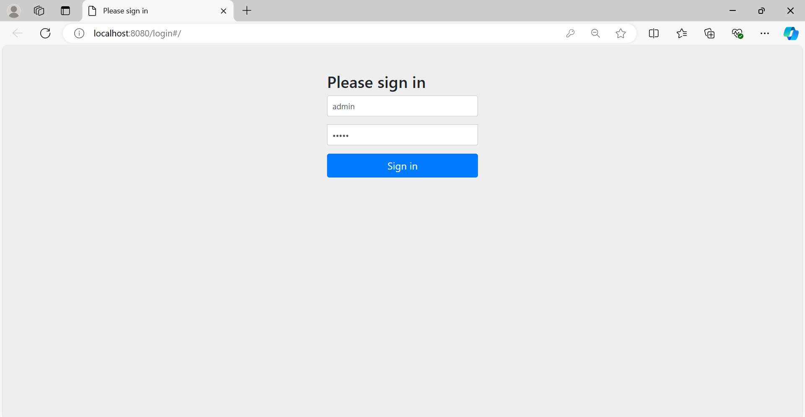
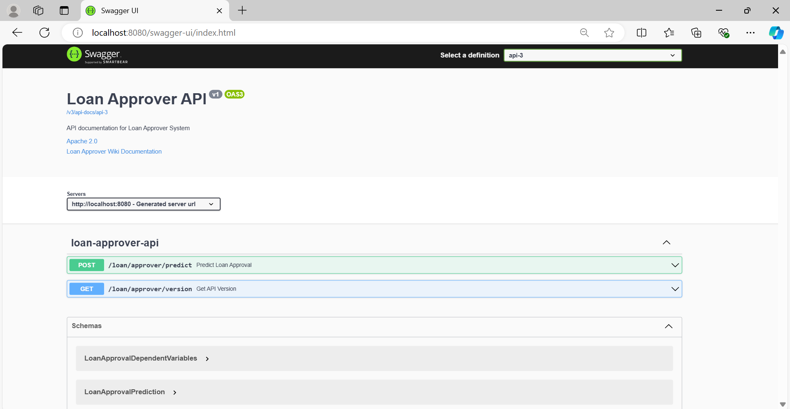
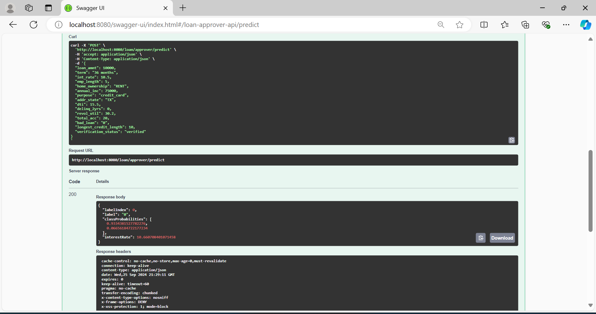
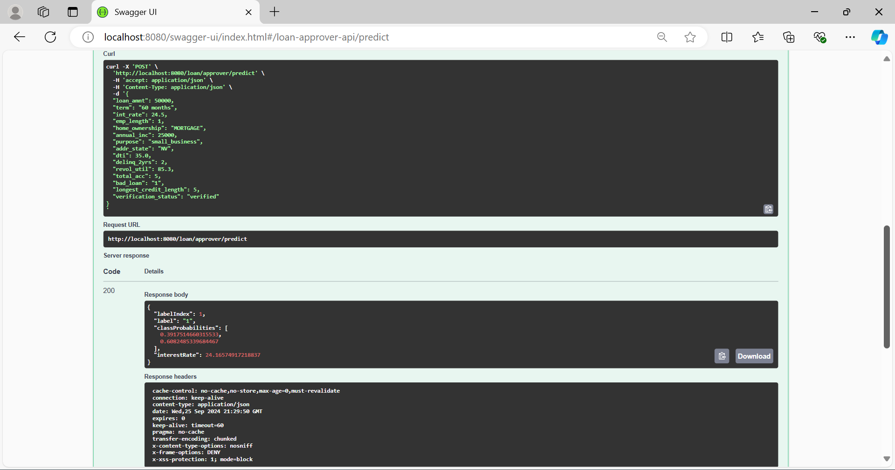
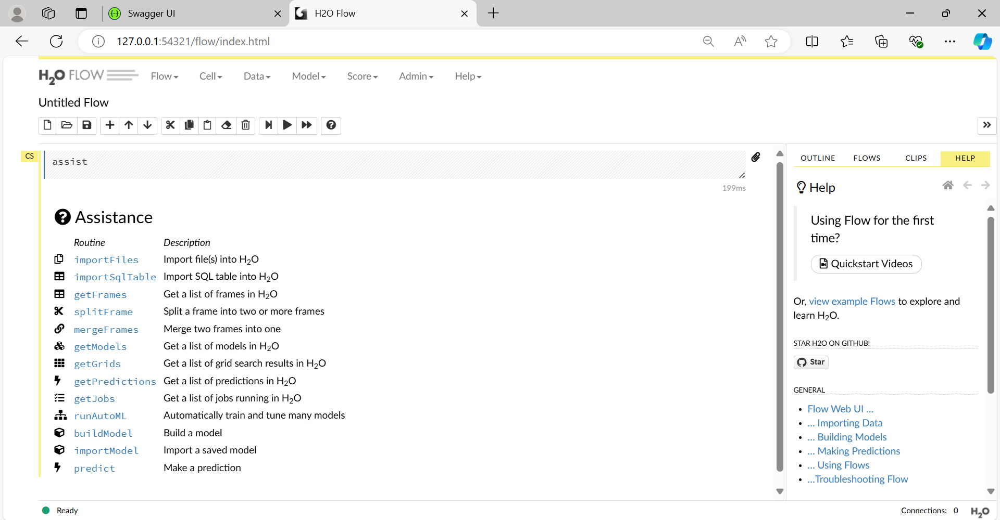

# QuickLoanPrediction - Loan Approver Using Spring Boot and H2O AutoML

## Overview

This project is a Loan Approver application developed using **Spring Boot** and **H2O AutoML**. The aim of this project is to predict whether a loan should be approved based on user input and to determine the loan's interest rate for approved loans. The system incorporates both **binary classification** for loan approval and **regression** for predicting the interest rate.

The entire process involves REST APIs that connect with machine learning models for real-time predictions, and the system is dockerized to ensure smooth deployment.

### Key Features:
- Loan approval prediction using machine learning.
- Integration of **H2O AutoML** for model building and prediction.
- REST API endpoints for real-time interaction with the system.
- Dockerized for easy deployment.

---

## Application Flow

The system consists of multiple components that work together to provide loan approval predictions.

1. **User Authentication:** The user must first sign in using the credentials to access the system.

   

2. **Swagger UI for API Testing:** The APIs are documented using Swagger UI, where users can test endpoints for loan predictions.

   

3. **Making a Loan Prediction (First Case):** The user inputs the necessary details about the loan and the model returns the prediction about whether the loan will be approved along with the interest rate.

   

4. **Making a Loan Prediction (Second Case):** A different set of inputs are given to the system to test a loan prediction. The system responds with whether the loan is approved or declined and the expected interest rate.
 
   

5. **H2O Flow UI for Monitoring Models:** The **H2O Flow UI** is used to manage, monitor, and visualize the performance of the models running in the background. It assists in checking data frames, models, and predictions.
 
   

6. **Loan Approval Prediction Flow:** The image below describes the complete prediction flow, including how dependent variables are processed by the system to predict whether the loan is approved and what interest rate should be applied.

    

---

## Tech Stack

- **Spring Boot:** Backend development and API integration.
- **H2O AutoML:** Automatic machine learning model building for loan approval and interest rate prediction.
- **Swagger UI:** API documentation and testing interface.
- **Docker:** Containerization of the application for easier deployment and scaling.
- **Gradle:** Build automation tool for compiling the project.
- **H2O Flow UI:** Interface to monitor model performance and tune the ML models.

---

## How It Works

### 1. Model Prediction Logic

The prediction model is built using **H2O’s AutoML**, which automatically selects the best machine learning algorithms based on the input data. The following two tasks are performed:
- **Loan Approval:** A classification task to predict whether the loan will be approved (yes/no).
- **Interest Rate Prediction:** A regression task to predict the interest rate for the approved loans.

### 2. API Endpoints

- **POST /loan/approver/predict:** Used to input loan details and retrieve approval status and interest rate.
- **GET /loan/approver/version:** Returns the current version of the API.

---

## Running the Application

### Prerequisites

Before running the application, make sure to install the following:

- Java 8+
- Docker (if using Docker for containerization)
- Gradle

### Steps

1. **Clone the repository:**
   ```bash
   git clone <repository-url>
   cd <repository-directory>
   
2. **Build the application:**
./gradlew build

3. **Run the Spring Boot application:**
java -jar build/libs/loanapprover-0.0.1-SNAPSHOT.jar

4. **Access the Swagger UI:** Open a browser and navigate to: http://localhost:8080/swagger-ui.html

5. **Dockerize the Application (Optional):**

Build the Docker image:
docker build -t loanapprover .

Run the Docker container:
docker run -p 8080:8080 loanapprover

### Notes
Make sure to test the API endpoints using Swagger for a seamless experience.
